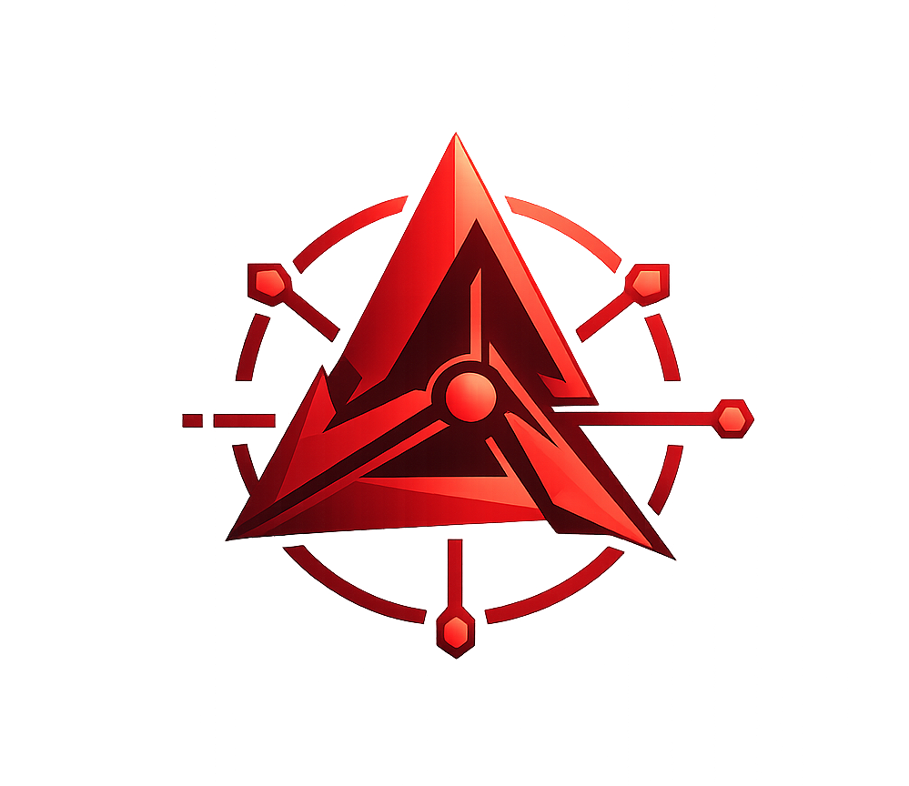
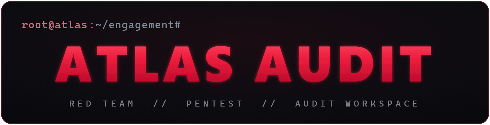
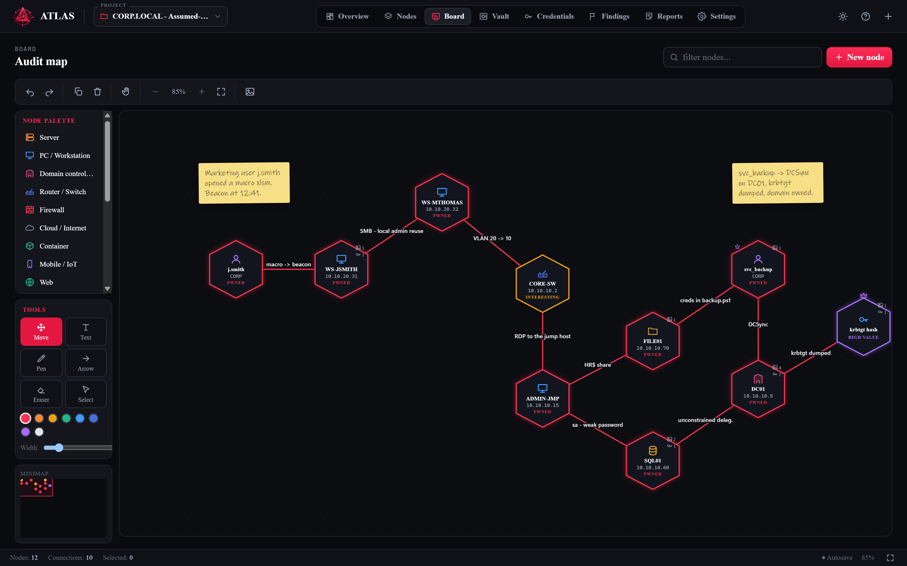
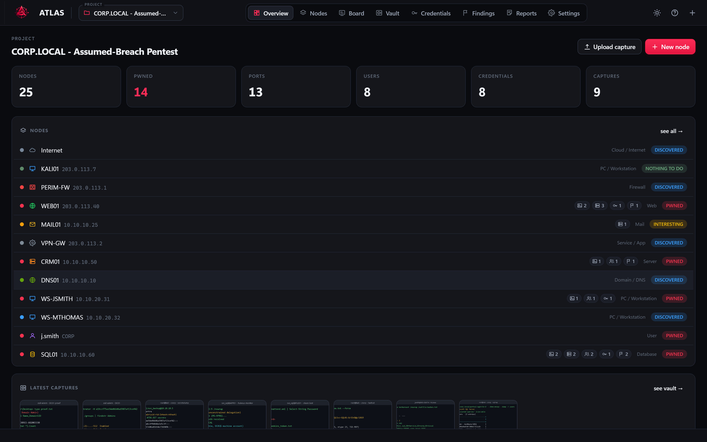
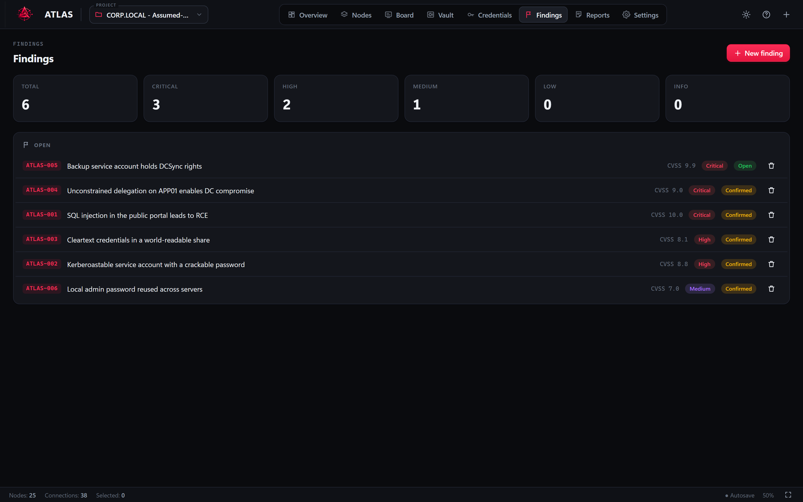
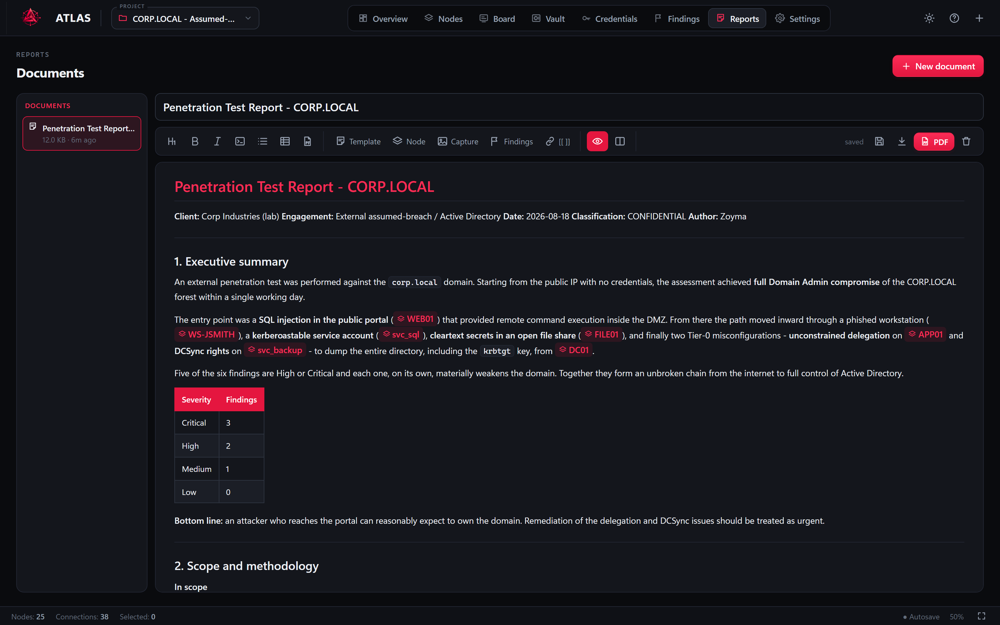
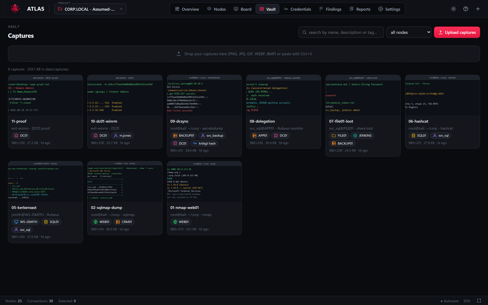
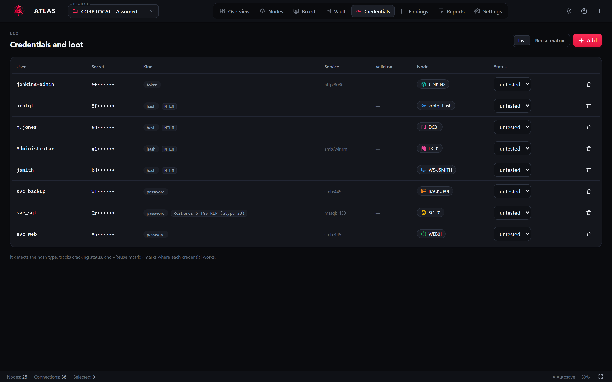
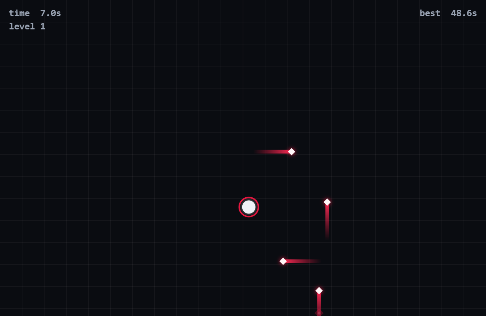

<p align="center">
  
</p>

<p align="center">
  
</p>

_ATLAS is a workspace for pentesters, red teamers and security auditors to organize their projects, infrastructure and findings._

Model the target as a collection of nodes — servers, users, credentials, domains, web applications or anything else relevant to the engagement — and connect them to build a visual map of the environment and its attack paths.

ATLAS doesn't scan or exploit anything for you. You use your own tools; ATLAS is where the project comes together.



> The screenshots throughout this README come from a sample engagement (`CORP.LOCAL`): a macro sent to a Marketing user, lateral movement across HR workstations, a service account looted from a backup script, and a hop into the server VLAN that ends in DCSync on the domain controller.

---

### Quick Start

ATLAS runs with Python 3.8+.

Clone the repository:

```bash
git clone https://github.com/Zoyma/atlas-audit
cd atlas-audit
```

Create your configuration file:

```bash
cp conf.example.json conf.json
```

Set your password:

```bash
python3 atlas.py --setup
```

ATLAS asks for a username (default `admin`), a password and a repeat of it, then
stores them in the database. **No credentials are ever written to `conf.json`.**

Start ATLAS:

```bash
python3 atlas.py
```

Then open:

```text
https://127.0.0.1:8777
```

Log in with the username and password you just set.

That one password does two jobs: it signs you in, and it encrypts every looted
secret in the database. There is **no recovery** — if you forget it, the
encrypted secrets are unreadable. See [Access and the vault](#access-and-the-vault).

With `tls` enabled, ATLAS generates a self-signed certificate on first start,
so the browser shows a warning once — accept it and the connection is encrypted
from then on. Set `"tls": false` to serve plain HTTP instead (only sensible on
localhost).

If you skip `--setup`, the first start at a terminal offers it. Press Enter at
the password prompt to skip and run without a login, which also means secrets
are stored unencrypted.

By default, all project data is stored locally, and each project gets its own
folder — see [Where your files live](#where-your-files-live).

---

### Documentation

For the full documentation, guides and detailed usage instructions, visit:

👉 **https://zoyma.github.io/atlas**

The documentation includes installation, configuration, usage guides, API reference and more.

---

### Features

#### Projects

Organize multiple security assessments in a single workspace.

- Independent projects
    
- Scope management
    
- Automatic saving
    
- Local SQLite storage
    

#### Nodes

> Model the infrastructure you discover.

- Servers and workstations
    
- Domain controllers
    
- Web applications and services
    
- Users and credentials
    
- Cloud, network and custom assets
    
- Ports, services and findings
    
- Notes and activity logs
    

#### Board

> A visual workspace for your assessment.

- Drag & drop nodes
    
- Connect assets and build attack paths
    
- Visual node states
    
- Screenshots directly on the board
    
- Freehand annotations
    
- Search and minimap
    
- Undo / redo
    
- Export the board as an image
    

#### Evidence

Keep everything related to the engagement in one place.

- Screenshot vault
    
- Assign evidence to one or multiple nodes
    
- Tags and descriptions
    
- Credential management
    
- Findings and severity tracking
    

#### Reports

Write and export your assessment directly from ATLAS.

- Markdown editor with live preview
    
- Pentest report templates
    
- Insert nodes, findings and evidence
    
- `[[Node]]` references
    
- Markdown export
    
- PDF export
    

#### Automation

ATLAS exposes a local JSON API, allowing you to integrate it with your own scripts and workflows.


---

### Screenshots

**Overview** — project metrics and the node inventory at a glance.



**Findings** — severity breakdown, CVSS scoring and status tracking.



**Reports** — a Markdown editor with `[[node]]` references, embedded evidence and one-click PDF export.



**Vault** — every screenshot in one place, each assignable to one or more nodes.



**Credentials** — looted secrets with hash-type detection and a node-by-node reuse matrix.



---

### Configuration

ATLAS uses a simple `conf.json` file for its basic configuration. It holds no
credentials: those are set with `--setup` and kept in the database.

```json
{
    "host": "127.0.0.1",
    "port": 8777,
    "tls": true,
    "cert": "",
    "key": "",
    "session_hours": 12,
    "allowed_hosts": []
}
```

| Option | Default | Meaning |
| --- | --- | --- |
| `host` | `127.0.0.1` | Interface to bind. Use `0.0.0.0` to expose ATLAS on the network. |
| `port` | `8777` | Port where ATLAS will run. |
| `tls` | `true` | Serve over HTTPS. A self-signed certificate is generated on first start. |
| `cert` / `key` | *(empty)* | Paths to your own certificate and private key. Leave empty to let ATLAS generate them. |
| `session_hours` | `12` | How long a login stays valid. Sessions are dropped when ATLAS restarts. |
| `allowed_hosts` | `[]` | Extra `Host` header values to accept (e.g. `["atlas.internal"]`). IP addresses and `localhost` are always accepted; this is only needed when reaching ATLAS by a hostname. |

Command line flags override the file, so `--port 9000` or `--no-tls` win over
whatever `conf.json` says.

A `conf.example.json` file is provided as a template.

**Without a `conf.json`**, ATLAS starts on plain HTTP at `127.0.0.1:8777` with no
certificate written to disk. Authentication is independent of the file: it is on
as soon as a password exists in the database.

**Upgrading from an older version?** If your `conf.json` still has `username` and
`password`, ATLAS moves them into the database on the next start and tells you to
delete them from the file. Nothing breaks and you are not locked out. Both keys
are deprecated and will be dropped in a future release.

Certificate generation needs either the `cryptography` package or an `openssl`
binary. If neither is available and `tls` was left at its default, ATLAS falls
back to HTTP and says so rather than refusing to start; if you explicitly set
`"tls": true`, it stops so the failure is not silent.

#### Command-line flags

Flags always override `conf.json`.

| Flag | Description |
| --- | --- |
| `--port N` | Port to listen on. |
| `--host H` | Interface to bind (`0.0.0.0` exposes ATLAS on the network). |
| `--data DIR` | Where the database and the per-project folders live (default `./data`). |
| `--conf DIR` | Folder holding `conf.json` (default: the repo root). |
| `--no-tls` | Serve plain HTTP even if `conf.json` enables TLS. |
| `--setup` | Ask for the username and password at the terminal, store them, and exit. |
| `--change-password` | Change the password at the terminal. Re-seals the vault key; nothing is re-encrypted. |
| `--no-browser` | Don't open the browser on start. |
| `--no-banner` | Start without the ASCII banner. |

#### Optional dependencies

The core runs on the Python standard library alone — login and vault encryption
included. These packages unlock extra features when present
(`pip install -r requirements.txt`):

| Package | Enables |
| --- | --- |
| `markdown-it-py` | Formatted report preview |
| `Pygments` | Syntax highlighting in code blocks |
| `reportlab` | PDF export |
| `Pillow` | Fitting screenshots neatly into the PDF |
| `cryptography` | Faster vault encryption, and automatic TLS certificate generation |

`cryptography` is a speed-up, not a requirement: ATLAS uses ChaCha20-Poly1305
either way and its own implementation reads and writes the identical format, so a
database stays readable on a machine that does not have the package.

On Kali/Debian, installing them via apt is recommended over pip:

```bash
sudo apt install python3-markdown-it python3-pygments python3-reportlab python3-pil
```

---

### Where your files live

Everything lives under `data/`, with one folder per project so nothing from two
engagements ends up mixed together:

```text
data/
  atlas.db                        the schema, metadata and sealed vault key
  projects/
    corp-local/                   named after the project
      captures/                   screenshots in the vault
        cap-00001-nmap-web01.png
        cap-00002-sqlmap-dump.png
      exports/                    everything ATLAS generates for you
        20260819-1551-pentest-report.pdf
        20260819-1551-pentest-report.md
        20260819-1554-corp-local.png
    acme-red-team/
      captures/
      exports/
```

The folder is named after the project. Two projects with the same name get a
`-2`, `-3` suffix, and renaming a project renames its folder to match. The folder
name is also recorded in the database, so a rename the filesystem refuses (a file
open in another program, for instance) leaves everything working — the folder
just keeps its old name.

**Exports are archived, not only downloaded.** Every report PDF, report `.md` and
board image is written into that project's `exports/` folder with a timestamp,
*and* handed to your browser as a download as before. So the engagement folder
keeps its own history and you can still drop the file wherever you like.

**Upgrading?** Older versions kept every screenshot in one flat `data/captures/`
folder. ATLAS moves them into the right project on the next start and reports what
it did. Nothing is deleted: a file no capture refers to any more is left in place
and pointed out, so you can look at it before removing it yourself.

Back up or hand over an engagement by copying the whole `data/` folder.

---

### Access and the vault

ATLAS has one password. It signs you in **and** it encrypts the secrets you loot
into the engagement, so there is nothing to keep in sync and no second passphrase
to remember.

Set it once:

```bash
python3 atlas.py --setup
```

Change it later, from the terminal or from **Settings → Access** in the app:

```bash
python3 atlas.py --change-password
```

#### How it works

The password never encrypts your data directly. ATLAS generates a random data key
that does the actual encryption, and seals that key with a key derived from your
password (PBKDF2-HMAC-SHA256, 240 000 rounds). Only the sealed form is ever
stored.

Two consequences worth knowing:

- **Changing the password is instant.** It re-seals the same data key rather than
  re-encrypting anything, so every secret stored under the old password stays
  readable. Every other browser session is signed out.
- **There is no recovery.** The data key exists only in sealed form, and only your
  password opens it. Forget the password and the encrypted secrets are gone. There
  is no backdoor, no reset and no support address that can help — this is
  deliberate for a tool that holds other people's credentials.

What is encrypted, and what is not:

| | |
| --- | --- |
| Encrypted | The `secret` field of every credential (passwords, hashes, keys, tokens). |
| Not encrypted | Node names, findings, notes, screenshots and the rest of the project. |

The data key lives in memory only, and only while someone is signed in. Restarting
ATLAS re-locks the vault: until the next login, the secrets on disk are just
ciphertext. If a session outlives the key somehow, the API answers `401` and the
UI asks you to sign in again rather than showing you garbage.

Secrets written by an older version stay in plain text until they are touched.
They are encrypted automatically the next time you sign in, and the startup output
tells you how many are still pending.

#### Running without a password

Skipping the setup is allowed and sometimes convenient on a throwaway local
instance. It means exactly what it says: no login, and secrets stored in plain
text in `data/atlas.db`. ATLAS says so on every start, and if you also bind to
`0.0.0.0` it says so louder.

Under Docker, systemd or anything else without a terminal to prompt on, ATLAS
starts in this open mode and tells you to run `--setup`.

---

### Cross-platform

> Built with Python and the standard library.

ATLAS runs on multiple operating systems without requiring external services, Docker, Node.js or a separate database.

- Linux
    
- Windows
    
- Python 3.8+
    
- No external database
    
- No Node.js
    
- No Docker
    
- No `pip` dependencies required for the core
    

#### Windows

```powershell
git clone https://github.com/Zoyma/atlas-audit
cd atlas-audit
copy conf.example.json conf.json
python atlas.py --setup
python atlas.py
```

#### Linux

```bash
git clone https://github.com/Zoyma/atlas-audit
cd atlas-audit
cp conf.example.json conf.json
python3 atlas.py --setup
python3 atlas.py
```

---

### Philosophy

ATLAS is **not another scanner or exploitation framework**.

It doesn't run tools, scan targets or attempt exploitation. The goal is to provide a flexible workspace where the information generated during an engagement can be organized, connected and documented.

Run Nmap, Burp, BloodHound, Metasploit or your own tooling wherever you want. Bring the relevant information into ATLAS and build the map of the engagement.

The focus is not on replacing your tooling, but on providing a central place to understand the engagement as a whole.

---

### Troubleshooting

**`port ... is already in use` on start** — an ATLAS instance is already running.
Open that one, stop it, or start this one on another port with `--port`. (ATLAS
refuses to start a second server on the same port so two instances can't fight
over it.)

**`SQLite cannot work on this folder` / disk I/O error** — you are running from
WSL against a Windows drive (`/mnt/c`), where file locking isn't available. Keep
the data on a Linux disk with `python3 atlas.py --data ~/atlas-data`, or start
ATLAS from Windows instead, where the same folder works natively.

**The browser warns about the certificate** — expected with `tls: true`: the
certificate is self-signed. Accept it once, or set `"tls": false` on localhost.

**A screenshot went missing after an upgrade** — the startup output says how
many files were moved into project folders and how many rows point at a file it
could not find. Anything it could not place is still in `data/captures/`; nothing
is deleted.

**"Capture deleted, but the file could not be removed"** — another program has
the image open (a viewer, a sync client, an antivirus scan). Close it and delete
the leftover from the project's `captures/` folder by hand.

**The UI looks stale after updating** — ATLAS tells the browser never to cache its
own code, but if you updated mid-session, do one hard refresh (Ctrl+Shift+R).

**`the vault is locked: sign in again`** — the data key is only held in memory
while someone is signed in, and ATLAS was restarted since. Sign in again.

**A secret shows as `<undecryptable>`** — that row will not open with the current
key. It happens when a `data/atlas.db` is mixed with an `app_auth` row from a
different install, usually a half-restored backup. Restore the whole `data/`
folder from the same point in time.

**`--setup` says a password is already set** — it switches to changing it, which
keeps every stored secret readable. Ctrl+C to leave it alone.

---

### Security

ATLAS is intended for **authorized security assessments only**.

**Access.** The username and password live in the database, not in a file.
Passwords are verified with PBKDF2-HMAC-SHA256 (240 000 rounds) and compared in
constant time, the username is compared in constant time too, the session cookie
is `HttpOnly` + `SameSite=Strict` (and `Secure` under TLS), and repeated failed
logins from the same address are locked out for a few minutes. Sessions live in
memory only, so restarting ATLAS signs everyone out. Changing the password rotates
your session token and drops every other one.

**At rest.** Credential secrets are encrypted with ChaCha20-Poly1305 under a random
data key that is itself sealed with your password. The key is held in memory only
while someone is signed in. Details in [Access and the vault](#access-and-the-vault).

**In transit.** With `tls` enabled, traffic is encrypted with TLS 1.2 or better.

**Request checks.** State-changing requests from a foreign `Origin` are refused, on
top of the `SameSite=Strict` cookie. Requests are also checked against
DNS-rebinding: ATLAS only answers to a `Host` of an IP address, `localhost`, or a
name you list in `allowed_hosts`, so a malicious website cannot rebind its domain
to `127.0.0.1` and reach your data. Proxy headers such as `X-Forwarded-For` are
not trusted, so nobody can reset their own login throttle by forging one.

Project data may contain sensitive information, including credentials, findings and screenshots. Treat the project data and configuration files as sensitive material.

`conf.json` is listed in `.gitignore` and should never be committed. So is
`data/`, which holds the database, the sealed key, the screenshots and the
exported reports — encryption protects the credential secrets inside it, not the
rest of the engagement.

Three things ATLAS does **not** do for you: the generated certificate is
self-signed, so it encrypts traffic but proves nothing about identity; binding
`host` to `0.0.0.0` puts the whole engagement on the network, so set a password
before you do; and it cannot recover a forgotten password.

---

#### EXTRA - "While it cracks"

The extra. A small dodging game for the dead time, **off by default** and switched
on at the bottom of Settings. While hashcat chews on a hash or a scan finishes,
lasers come in from every side and you dodge them with WASD; it speeds up every
10 seconds and keeps your best time. P pauses, R restarts, and it pauses itself
when you switch windows — going to check on that scan costs you nothing.

One self-contained file, no dependencies, no assets, and nothing to do with your
engagement data: the switch and your best time live in the browser's
localStorage, never in the database.

**While it cracks** — the extra: a dodging game for the dead time, off by default.




### Note

ATLAS is designed to help operators organize and document security assessments.

It does not scan targets, execute exploits or automate attacks. You are responsible for the tools you use and the systems you interact with.

Only use ATLAS against systems and environments you are authorized to assess.


## License

ATLAS is available under the ATLAS License.

You may use, study, modify and redistribute ATLAS, including for
professional and internal business use.

You may not sell ATLAS or offer a substantially similar product or service
based on ATLAS without permission from the copyright holder.
